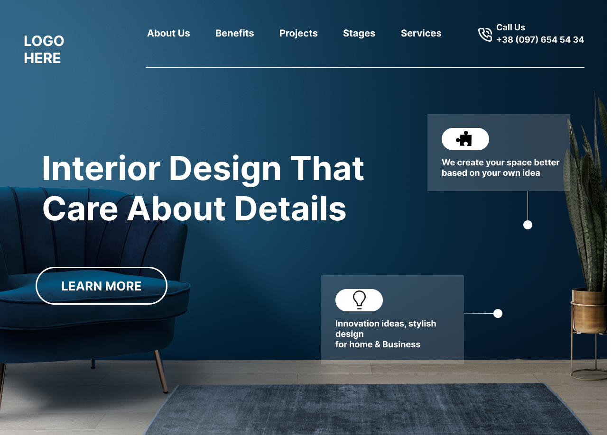

# Interior Design Landing Page

**Name**: Aarya Nanndaann Singh M N

**Time**:  75mins 

**Concepts Explored**: CSS Positions, Flexbox, Background Properties, Handling SVG

### **Stack**:

## Metadata Of Project
**Site Type:** *STATIC*

**Responsive:** ❌

## What I Learnt

Here I got a chance to explore the CSS Position Property. After quite a bit of hit and trail I got a clarity on the values on what to use when. I had also explored flexbox concepts, Background properties and I also explored how to handle SVGs. Overall It was a great experience.

## Live Link
**[Project in Action 🔥](https://interior-design-fsjs.netlify.app/)**